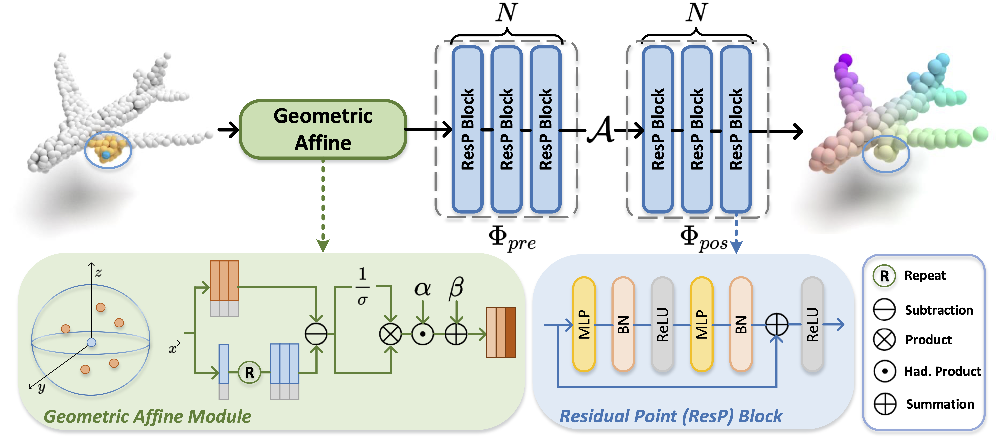

# Rethinking Network Design and Local Geometry in Point Cloud: A Simple Residual MLP Framework （ICLR 2022）


[](https://paperswithcode.com/sota/3d-point-cloud-classification-on-modelnet40?p=rethinking-network-design-and-local-geometry-1)
[](https://paperswithcode.com/sota/3d-point-cloud-classification-on-scanobjectnn?p=rethinking-network-design-and-local-geometry-1)


[](https://github.com/ma-xu/pointMLP-pytorch)


<div align="left">
    <a></a>
    <a></a>
    <a></a>
</div>

 [open review](https://openreview.net/forum?id=3Pbra-_u76D) | [arXiv](https://arxiv.org/abs/2202.07123) | Primary contact: [Xu Ma](mailto:ma.xu1@northeastern.edu)

<div align="center">
  
</div>

Overview of one stage in PointMLP. Given an input point cloud, PointMLP progressively extract local features using residual point MLP blocks. In each stage, we first transform local point using a geometric affine module, then local points are are extracted before and after aggregation respectively. By repeating multiple stages, PointMLP progressively enlarge the receptive field and model entire point cloud geometric information.


## BibTeX

    @article{ma2022rethinking,
        title={Rethinking network design and local geometry in point cloud: A simple residual MLP framework},
        author={Ma, Xu and Qin, Can and You, Haoxuan and Ran, Haoxi and Fu, Yun},
        journal={arXiv preprint arXiv:2202.07123},
        year={2022}
    }

## Model Zoo
- The codes/models/logs for submission version (without bug fixed) can be found here [commit:d2b8dbaa](http://github.com/13952522076/pointMLP-pytorch/tree/d2b8dbaa06eb6176b222dcf2ad248f8438582026).

- On ModelNet40, fixed pointMLP achieves a result of **91.5% mAcc** and **94.1% OA** without voting, logs and pretrained models can be found [[here]](https://web.northeastern.edu/smilelab/xuma/pointMLP/checkpoints/fixstd/modelnet40/pointMLP-20220209053148-404/).
- On ScanObjectNN, fixed pointMLP achieves a result of **84.4% mAcc** and **86.1% OA** without voting, logs and pretrained models can be found [[here]](https://web.northeastern.edu/smilelab/xuma/pointMLP/checkpoints/fixstd/scanobjectnn/pointMLP-20220204021453/). Fixed pointMLP-elite achieves a result of **81.7% mAcc** and **84.1% OA** without voting, logs and pretrained models can be found [[here]](https://web.northeastern.edu/smilelab/xuma/pointMLP/checkpoints/fixstd/scanobjectnn/model313Elite-20220220015842-2956/).
- Stay tuned. More elite versions and voting results will be uploaded.


## News & Updates:

- [x] fix the uncomplete utils in partseg by Mar/10, caused by error uplaoded folder.
- [x] upload test code for ModelNet40
- [ ] project page
- [x] update std bug (unstable testing in previous version)
- [x] paper/codes release

:point_right::point_right::point_right:**NOTE:** The codes/models/logs for submission version (without bug fixed) can be found here [commit:d2b8dbaa](http://github.com/13952522076/pointMLP-pytorch/tree/d2b8dbaa06eb6176b222dcf2ad248f8438582026).

<details>
  <summary>:fast_forward: Questions on ModelNet40 classification reproduction</summary>
  The performance on ModelNet40 of almost all methods are not stable, see (https://github.com/CVMI-Lab/PAConv/issues/9#issuecomment-873371422).
  If you run the same codes for several times, you will get different results.
  Also, the randomness of ModelNet40 is our motivation to experiment on ScanObjectNN benchmark, and to report the mean/std results of several runs.

</details>


## Install

```bash
# step 1. clone this repo
git clone https://github.com/ma-xu/pointMLP-pytorch.git
cd pointMLP-pytorch

# step 2. create a conda virtual environment and activate it
conda env create
conda activate pointmlp
```

```bash
# Optional solution for step 2: install libs step by step
conda create -n pointmlp python=3.7 -y
conda activate pointmlp
conda install pytorch==1.10.1 torchvision==0.11.2 cudatoolkit=10.2 -c pytorch -y
# if you are using Ampere GPUs (e.g., A100 and 30X0), please install compatible Pytorch and CUDA versions, like:
# pip install torch==1.8.1+cu111 torchvision==0.9.1+cu111 torchaudio==0.8.1 -f https://download.pytorch.org/whl/torch_stable.html
pip install cycler einops h5py pyyaml==5.4.1 scikit-learn==0.24.2 scipy tqdm matplotlib==3.4.2
pip install pointnet2_ops_lib/.
```


## Useage

### Classification ModelNet40
**Train**: The dataset will be automatically downloaded, run following command to train.

By default, it will create a folder named "checkpoints/{modelName}-{msg}-{randomseed}", which includes args.txt, best_checkpoint.pth, last_checkpoint.pth, log.txt, out.txt.
```bash
cd classification_ModelNet40
# train pointMLP
python main.py --model pointMLP
# train pointMLP-elite
python main.py --model pointMLPElite
# please add other paramemters as you wish.
```


To conduct voting testing, run
```bash
# please modify the msg accrodingly
python voting.py --model pointMLP --msg demo
```


### Classification ScanObjectNN

The dataset will be automatically downloaded

- Train pointMLP/pointMLPElite 
```bash
cd classification_ScanObjectNN
# train pointMLP
python main.py --model pointMLP
# train pointMLP-elite
python main.py --model pointMLPElite
# please add other paramemters as you wish.
```
By default, it will create a fold named "checkpoints/{modelName}-{msg}-{randomseed}", which includes args.txt, best_checkpoint.pth, last_checkpoint.pth, log.txt, out.txt.


### Part segmentation

- Make data folder and download the dataset
```bash
cd part_segmentation
mkdir data
cd data
wget https://shapenet.cs.stanford.edu/media/shapenetcore_partanno_segmentation_benchmark_v0_normal.zip --no-check-certificate
unzip shapenetcore_partanno_segmentation_benchmark_v0_normal.zip
```

- Train pointMLP
```bash
# train pointMLP
python main.py --model pointMLP
# please add other paramemters as you wish.
```


## Acknowledgment

Our implementation is mainly based on the following codebases. We gratefully thank the authors for their wonderful works.

[CurveNet](https://github.com/tiangexiang/CurveNet),
[PAConv](https://github.com/CVMI-Lab/PAConv),
[GDANet](https://github.com/mutianxu/GDANet),
[Pointnet2_PyTorch](https://github.com/erikwijmans/Pointnet2_PyTorch)

## LICENSE
PointMLP is under the Apache-2.0 license. 


